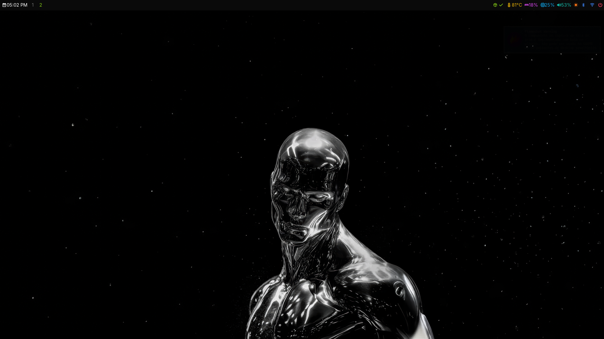
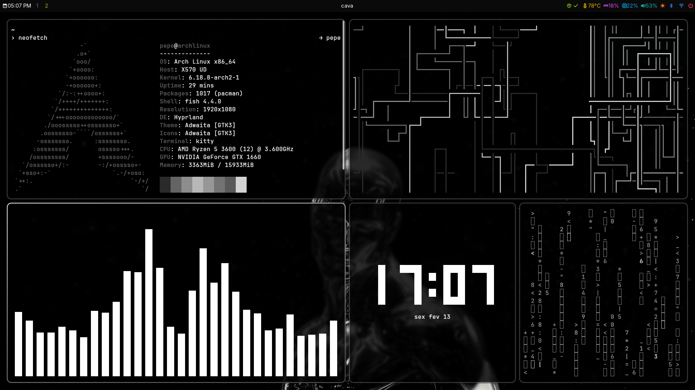
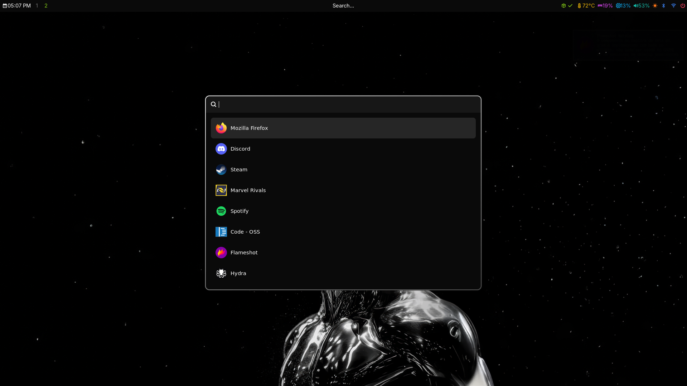
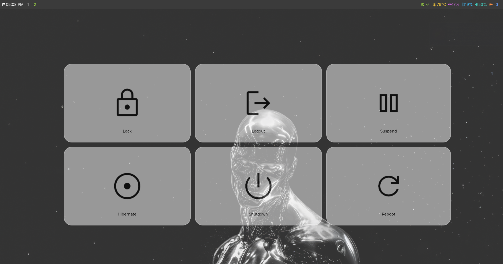

 # 🚀 Dotfiles

Minha configuração pessoal do Arch Linux com o gerenciador de janelas Hyprland.

## 📋 Conteúdo

- [ScreenShots](#-screenshots)
- [Visão Geral](#-visão-geral)
- [Requisitos](#-requisitos)
- [Instalação](#-instalação)
- [Personalização](#-personalização)
- [Atalhos](#-atalhos-de-teclado)
- [Temas](#-temas)
- [Licença](#-licença)


## 👀 ScreenShots









## 🔍 Visão Geral

Estes dotfiles foram criados para proporcionar um ambiente de desenvolvimento Linux elegante, eficiente e altamente produtivo. Configurações cuidadosamente ajustadas para gerenciadores de janelas, terminais, editores e muito mais!

### 🖥️ Sistema Base
- **Distro**: Arch Linux
- **Shell**: Fish
- **Terminal**: Kitty

### 📦 Interface e Gerenciamento

- **Window Manager**: Hyprland
- **Bar**: Waybar
- **Launcher**: Wofi
- **Power Menu**: Wlogout 
- **Lock Screen**: hyprlock

### 🎨 Estética e Notificações

- **Notifications**: dunst
- **Wallpapers**: awww
- **Fonts**: JetBrains Mono Nerd Font

### 🛠️ Ferramentas de Produtividade
- **File Manager**: Dholpin
- **Editor**: Neovim


## 📦 Requisitos

- Linux (testado em Arch Linux + Hyprland)
- Git
- [GNU Stow](https://www.gnu.org/software/stow/) para gerenciar links simbólicos
- Aplicativos específicos para cada configuração (listados abaixo)

## 💻 Instalação

1. Clone este repositório:
```bash
git clone https://github.com/phmoraesdev/dotfiles
```

2. Entre na pasta:
```bash
  cd dotfiles
```

3. Use o GNU Stow para criar links simbólicos para a configuração desejada:
```bash
stow hyprland   # Para configuração do Hyprland
# OU
stow i3         # Para configuração do i3
# OU qualquer outra configuração disponível
```

> **⚠️ Importante**: Certifique-se de que não existem arquivos de configuração conflitantes antes de usar o Stow. Recomenda-se fazer backup das configurações existentes.

## 🖌️ Personalização

Os dotfiles foram projetados para serem facilmente personalizáveis:

- **Cores e Temas**: Edite os arquivos de configuração para alterar esquemas de cores
- **Fontes**: A configuração usa fonts Nerd ou JetBrains Mono por padrão
- **Ícones**: Compatível com diversos pacotes de ícones
- **Comportamentos**: Ajuste atalhos de teclado e comportamentos nos respectivos arquivos de configuração

## ⌨️ Atalhos de Teclado

Atalhos do Hyprland

| Atalho | Ação |
|--------|------|
| `Super + Enter` | Abrir terminal |
| `Super + Q` | Abrir menu de aplicativos |
| `Super + backspace` | Fechar janela atual |
| `Super + 1-9` | Alternar entre workspaces |
| `Super + Shift + 1-9` | Mover janela para workspace |
| `Super + F` | Alternar modo fullscreen |
| `Super + Mouse` | Mover janelas flutuantes |


## 🎭 Temas

A configuração atual inclui temas integrados que podem ser facilmente alternados. Edite os respectivos arquivos de configuração para mudar o tema:

- **Terminal**: Configurações de cores em `~/.config/kitty/theme.conf`
- **Neovim**: Temas em `~/.config/nvim/lua/custom/chadrc.lua`
- **WM**: Cores em `~/.config/hypr/hyprland.conf`

## 📄 Licença

Este projeto está licenciado sob a [MIT License](LICENSE).

---

<div align="center">
  <p>Feito por <a href="https://github.com/phmoraesdev">Pedro Moraes</a></p>
  <p>Inspirado por várias configurações incríveis da comunidade Linux</p>
</div>
